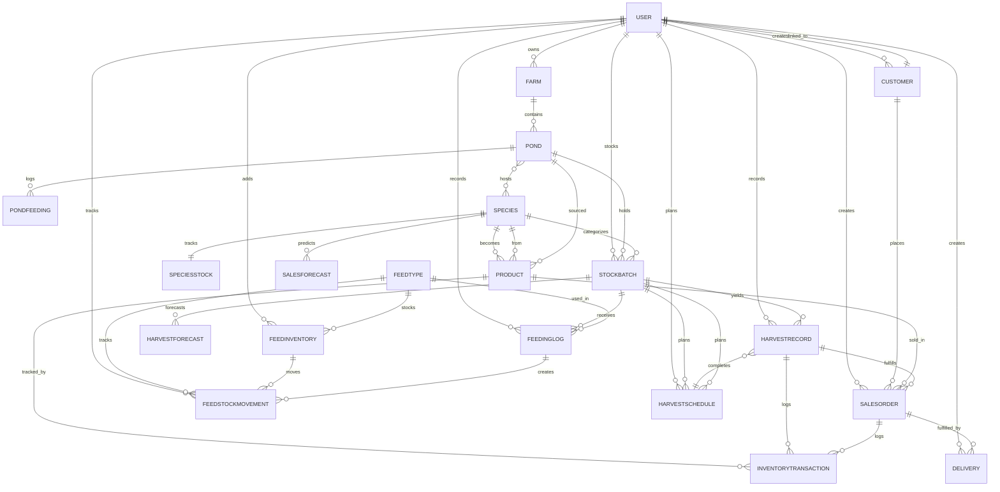

# Lantad Aquaculture System - Entity Relationship Diagram

## Mermaid ERD



## Entity Descriptions

### Core Entities

| Entity | Purpose | Key Attributes |
|--------|---------|-----------------|
| **USER** | System users (admin, staff) | username, email, role, phone, profile_image |
| **CUSTOMER** | Buyers of products | name, type, contact_person, phone, address, credit_limit |
| **FARM** | Physical farm/location | name, location, total_area, owner_id |
| **POND** | Individual aquaculture unit | name, farm_id, size, depth, capacity, status |

### Stock & Species

| Entity | Purpose | Key Attributes |
|--------|---------|-----------------|
| **SPECIES** | Fish/shrimp types | name, category, scientific_name, market_weight_g, temp/pH ranges |
| **SPECIESSTOCK** | Available quantity per species | species_id, available_quantity |
| **STOCKBATCH** | Cohort in a pond | pond_id, species_id, batch_code, stocking_date, quantity, weight, stage |

### Harvest

| Entity | Purpose | Key Attributes |
|--------|---------|-----------------|
| **HARVESTSCHEDULE** | Planned harvest | stock_batch_id, scheduled_date, est_quantity/weight, status |
| **HARVESTRECORD** | Actual harvest results | harvest_date, quantity_harvested, total_weight_kg, grade_a/b/c counts |
| **HARVESTFORECAST** | ML predictions | predicted_harvest_date, predicted_weight, confidence_level, algorithm |

### Sales & Inventory

| Entity | Purpose | Key Attributes |
|--------|---------|-----------------|
| **PRODUCT** | Sellable inventory | name, species_id, pond_id, quantity_kg, unit_price, reorder_level |
| **SALESORDER** | Customer order | order_number, customer_id, quantity_kg, price_per_kg, status, payment_status |
| **INVENTORYTRANSACTION** | Stock movement log | product_id, quantity_kg, type (sale/stock_in/adjustment), related_order_id |
| **DELIVERY** | Order fulfillment | order_id, scheduled_date, delivery_location, quantity_kg, status |

### Feed Management

| Entity | Purpose | Key Attributes |
|--------|---------|-----------------|
| **FEEDTYPE** | Feed products | name, brand, category, protein_content, price_per_kg |
| **FEEDINVENTORY** | Feed stock | feed_type_id, quantity_kg, purchase_date, expiry_date, batch_number |
| **FEEDINGLOG** | Daily feeding record | stock_batch_id, feed_type_id, quantity_kg, feeding_time, fed_by |
| **FEEDSTOCKMOVEMENT** | Feed ledger | feed_type_id, movement_type (in/out/adjustment), delta_kg |
| **PONDFEEDING** | Pond-level feeding | pond_id, feed_type_id, fed boolean, recorded_by, recorded_at |

### Analytics

| Entity | Purpose | Key Attributes |
|--------|---------|-----------------|
| **SALESFORECAST** | Demand predictions | forecast_date, period, predicted_demand_kg, confidence_level, species_id |

## Key Relationships

### Ownership & Access Control
- `USER` → `FARM`: One user owns multiple farms
- `USER` → `STOCKBATCH`: User stocks batches (audit trail)
- `USER` → `CUSTOMER`: Users manage customer relationships
- `CUSTOMER` → `USER`: Customers can link to user accounts (optional)

### Farming Hierarchy
- `FARM` → `POND`: Farm contains multiple ponds
- `POND` ↔ `SPECIES`: Pond hosts multiple species (M2M)
- `POND` → `STOCKBATCH`: Pond holds stock batches

### Production Flow
```
SPECIES → STOCKBATCH (in POND) → HARVESTSCHEDULE
                                       ↓
                                 HARVESTRECORD
                                       ↓
                                   PRODUCT
                                       ↓
                                 SALESORDER
                                       ↓
                                   DELIVERY
```

### Feed Supply Chain
```
FEEDTYPE → FEEDINVENTORY → FEEDSTOCKMOVEMENT
              ↓                      ↓
         FEEDINGLOG ←────────────────
              ↓
         STOCKBATCH (consumption)
```

### Inventory Tracking
```
HARVESTRECORD → INVENTORYTRANSACTION ← SALESORDER
                      ↑
                   PRODUCT
                      ↓
              (quantity tracked)
```

## Cardinality Legend

| Symbol | Meaning |
|--------|---------|
| `\|\|` | One |
| `o\{` | Zero or more |
| `o\|` | Zero or one |

Example: `FARM \|\|--o{ POND` = "One FARM has zero or many PONDs"

## Constraints & Business Rules

1. **Species Protection**: Deleting a species is prevented if batches exist (`on_delete=PROTECT`)
2. **Cascade Deletes**: Pond deletion cascades to stock batches, feeding logs
3. **Audit Trail**: CreatedBy/UpdatedAt tracked on most entities
4. **Stock Deduction**: Happens only on order delivery (via `stock_deducted` flag)
5. **Harvest Quality**: Graded into A/B/C with quality evaluation logic
6. **Feed Cost Tracking**: FeedingLog calculates cost = quantity × feed_type.price_per_kg
